# 1. Motivation

Natural disasters are rising in frequency in the public record, but it is not obvious from raw counts alone whether this reflects a genuine environmental/climatic shift, an artifact of improved global disaster reporting since the mid-20th century, or both. Separately, "frequency" and "severity" are often conflated in public discourse — a country that experiences many disasters is not necessarily the country that suffers the most deaths or economic loss from them. This report uses the EM-DAT database to disentangle these questions along three axes — **when** disasters occur, **where** they occur, and **how severe** their human/economic consequences are — and to identify where policy attention (frequency-driven mitigation vs. severity-driven early warning) is best targeted.

# 2. Dataset Description

**Dataset:** EM-DAT Natural Disasters Emergency Events Database (Country Profiles)
**Source:** [kaggle.com/datasets/mexwell/natural-disasters-emergency-events-database](https://www.kaggle.com/datasets/mexwell/natural-disasters-emergency-events-database)
**Scope:** 10,431 records, 1900–2023, 225 countries, 13 natural disaster types (all under the single "Natural" disaster group — no technological/man-made disasters in this dataset).

**Fields (all used across the three task sets below):**

| Field | Type | Used in |
|---|---|---|
| Year | Temporal | A (primary axis), B, C |
| Country / ISO | Categorical / Code | B (primary axis), C |
| Disaster Group | Categorical | Dataset scoping (single value: "Natural") |
| Disaster Subgroup | Categorical | Dataset description |
| Disaster Type | Categorical | A, B, C (encoding variable throughout) |
| Disaster Subtype | Categorical | A (Fig. 8, subtype breakdown), B (Fig. 29, diversity) |
| Total Events | Numerical (count) | A, B, C (core volume metric) |
| Total Affected | Numerical (count) | C (Fig. 38-40) |
| Total Deaths | Numerical (count) | C (primary severity metric) |
| Total Damage (USD, original) | Numerical (currency) | C (Fig. 44, inflation comparison) |
| Total Damage (USD, adjusted) | Numerical (currency) | C (primary economic metric) |
| CPI | Numerical (index) | C (Fig. 42, shown directly) |
| Reporting Era (derived) | Categorical | A (Fig. 4, 9, 14), B (Fig. 21-22, 26) |
| Decade (derived) | Temporal (binned) | A (Fig. 2, 12), B (Fig. 28), C (Fig. 45) |

**Missingness:** Total Affected (2,845 missing, 27.3%), Total Deaths (3,056 missing, 29.3%), Damage original (6,597 missing, 63.2%), Damage adjusted (6,601 missing, 63.3%), Disaster Subtype (2,133 missing, 20.4%). Missingness is heavily concentrated in pre-1980 records, where reporting agencies frequently logged that an event occurred without quantifying its impact.

# 3. Methodology / Preprocessing

1. **Format normalization:** converted the source file's `;`-delimiter to `,` and stripped whitespace from column names for tool compatibility (Tableau/pandas).
2. **Data-quality fixes:** corrected source typos ("Disaster Subroup" → "Disaster Subgroup", trailing space on "Extreme temperature "), and fixed the CPI field, which was stored with comma decimal separators (e.g. `2,8490844088613` instead of `2.849...`) and would otherwise be read as text.
3. **Missing-value policy:** Total Affected / Total Deaths / Damage fields were left as `NaN` rather than imputed as zero. In this dataset, "0 impact" and "not reported" are semantically different, and zero-imputing would have silently deflated severity figures for early-20th-century events, which are undercounted rather than genuinely low-impact.
4. **Derived fields:** added `Reporting Era` (Pre-1980 vs. 1980–present) as an explicit analytical control for the reporting-infrastructure caveat discussed in Section 8, and `Decade` (10-year bins of Year) for decade-level aggregation used across all three task sets.
5. **Tooling:** data cleaning and all 45 visualizations were generated in Python (pandas + matplotlib) directly from the cleaned CSV; the same file (`data/emdat_cleaned.csv`) is also loadable into Tableau for further interactive exploration.

# 4. Guiding Question

*How have natural disasters evolved in frequency, geographic distribution, and human/economic impact over the last century, and which disaster types and regions demand the most attention today?*

This question is addressed through three complementary, non-overlapping task sets — one per team member — each covering a cohesive subset of variables. Per TA/instructor guidance (Sep 10, 2026), each member generated up to 15 visualizations; all 15 per person (45 total) are presented and explained below, favoring multi-variable, informative encodings over simple 2-variable charts, across a variety of chart types.

# 5. Task Set A — Temporal Trends (Arnav Jain)

**Variables used:** Year, Disaster Type, Disaster Subtype, Total Events, Reporting Era, Decade

**Tasks:** Overview of events over time; trends by disaster type; pre-/post-1980 comparison accounting for the reporting-bias caveat; distributional and volatility characteristics of the event-count series.

**Figure 1.** Stacked area chart, Year × Disaster Type × Total Events (5-year rolling average). *Interpretation:* Recorded events rise from single digits per year before 1970 to a peak of roughly 370 events/year around 2007-2010, an over 30-fold increase. Floods and storms account for the overwhelming majority of the post-1980 increase, while geophysical events (earthquakes, volcanic activity) grow only modestly in absolute terms — the first signal that "more disasters" really means "more hydro-meteorological disasters," not a uniform rise.

**Figure 2.** Heatmap, Disaster Type × Decade, color-encoding Total Events. *Interpretation:* The 2000s and 2010s are the most disaster-dense decades for nearly every category simultaneously, ruling out a single type driving the overall trend alone. Floods show the steepest decade-over-decade growth of any category, consistent with Figure 1.

**Figure 3.** Small multiples, Year × Total Events trellised by Disaster Type, pre-1980 era shaded. *Interpretation:* Every type shows near-zero recorded activity pre-1980 — even earthquakes and volcanic eruptions, which are physically salient and hard to under-report. This is direct evidence the shaded region reflects a reporting gap rather than a genuinely quieter era.

**Figure 4.** Annualized event rate (events/year), pre-1980 vs. 1980–present, by disaster type. *Interpretation:* Floods rise **17.8×** (6.7 → 119.6/yr), storms **9.2×** (9.6 → 87.4/yr), droughts **8.2×** (1.8 → 14.9/yr), while earthquakes — a reporting-bias control, since they are hard to miss even in 1950 — rise only **3.8×** (6.5 → 24.6/yr). The gap between earthquakes' 3.8× and floods' 17.8× is evidence of a genuine additional rise in hydro-meteorological disasters, layered on top of a reporting-driven baseline shift common to all types.

**Figure 5.** Overview line chart, total events per year, 1900–2023. *Interpretation:* A simple orientation figure showing the same rise-then-plateau shape as Figure 1's aggregate envelope, with a visible flattening after approximately 2005.

**Figure 6.** 100%-stacked area chart, Year × Disaster Type × Share of Events. *Interpretation:* Normalizing removes the volume trend and isolates composition: flood's *share* of all events rises steadily through the 1980s-2000s even as total volume was also rising, meaning floods grew disproportionately faster than the overall trend, not just in step with it.

**Figure 7.** Cumulative events by type, 1900–2023 (multi-line). *Interpretation:* Floods and storms show visibly steepening (convex) cumulative curves from the 1980s onward, while earthquakes and droughts grow closer to linearly — a different way of showing the same acceleration seen in Figure 4, without needing to pick a smoothing window.

**Figure 8.** Stacked area, Year × Flood Subtype × Total Events (5-yr rolling avg). *Interpretation:* Drilling into the largest category (floods), riverine floods (1,628 records) and flash floods (635) dominate, with riverine flooding's rise post-1980 mirroring the aggregate flood trend in Figure 1 — indicating the flood increase is concentrated in river-basin flooding rather than distributed evenly across flood subtypes.

**Figure 9.** Year-over-year growth rate in total events (3-year smoothed), with pre-1980 era shaded. *Interpretation:* Growth-rate volatility is far higher pre-1980 (small denominators exaggerate percentage swings) and settles into a calmer, mostly-positive band post-1980 — itself a symptom of the low, noisy pre-1980 baseline discussed in Figure 3.

**Figure 10.** Boxplot, distribution of per-record Total Events by Disaster Type (outliers excluded). *Interpretation:* Most disaster types have a tight per-record distribution (a "record" is usually a single country-year-type entry with a small event count), so the dramatic differences seen in earlier figures come from record *frequency* over time/countries, not from individual records reporting unusually large counts.

**Figure 11.** Bubble chart, Year × Total Events, bubble size/color = Disaster Type. *Interpretation:* An alternative, non-stacked view of Figure 1's data — the growing bubble density and size toward the right (recent years) for flood/storm bubbles visually reinforces the same finding while making individual year-type data points, rather than a continuous band, the unit of perception.

**Figure 12.** Stacked bar, Decade × Dominant Disaster-Type Composition (share of events). *Interpretation:* Flood's share of the decade's event mix grows from a minor slice pre-1970 to the largest single slice in the 2000s-2010s, the clearest single-figure summary of the compositional shift documented across Figures 1, 6, and 7.

**Figure 13.** Histogram, distribution of Total Events per record, log y-axis. *Interpretation:* The distribution is heavily right-skewed — the large majority of records report a small number of events (often 1), with a long thin tail of higher-count records, typical of count data aggregated at the country-year-type level.

**Figure 14.** 10-year rolling volatility (standard deviation) of annual event counts. *Interpretation:* Volatility itself has been rising alongside the mean event count since the 1980s, meaning not only are there more disasters on average, but year-to-year unpredictability in total disaster load has also increased — relevant for disaster-response capacity planning, which must budget for high-variance years, not just the average.

**Figure 15.** Scatter, Year vs. Total Events with linear trend line and R². *Interpretation:* A simple linear fit already explains a substantial share of the year-to-year variance (see R² printed on the figure), confirming the rise is a real, fittable long-run trend rather than pure noise — while the visible curvature in the residuals (events accelerate faster than a straight line after 1980) is exactly why Figures 1-12 use non-linear/segmented views to characterize the trend more precisely.

# 6. Task Set B — Geographic Distribution (Kalpit Phogat)

**Variables used:** Country, ISO, Disaster Type, Disaster Subtype, Total Events, Reporting Era, Decade

**Tasks:** Overview of events by country; which countries are most exposed to which disaster type; regional/composition profiles; how country exposure has shifted between reporting eras; breadth vs. depth of geographic risk.

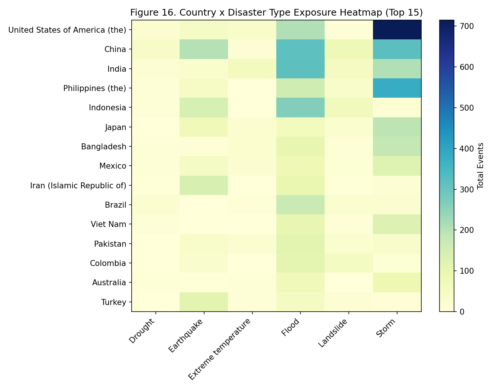

**Figure 16.** Heatmap, Country × Disaster Type (top-15 by event count), color = Total Events. *Interpretation:* The USA's 1,125 events are storm-dominated, China's 985 and India's 689 flood-dominated, while the Philippines (662) shows a mixed storm/flood/earthquake profile. No two countries in the top-15 share an identical profile.

**Figure 17.** Stacked horizontal bar, disaster-type composition (share) per country. *Interpretation:* Normalizing by country total shows some lower-volume countries (Bangladesh, Vietnam) are almost entirely flood/storm-exposed — narrow but severe — while the USA's large total spreads more evenly across storms, floods, and wildfires.

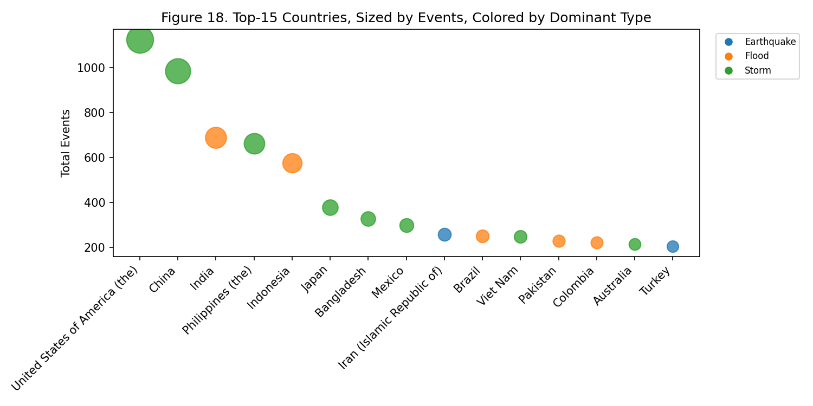

**Figure 18.** Bubble chart, countries ranked by Total Events, size = volume, color = dominant type. *Interpretation:* Flood-dominant countries (China, India, Bangladesh, Vietnam) visually cluster apart from storm-dominant countries (USA, Philippines, Japan) — geographic exposure follows physical/climatic zones rather than being randomly distributed.

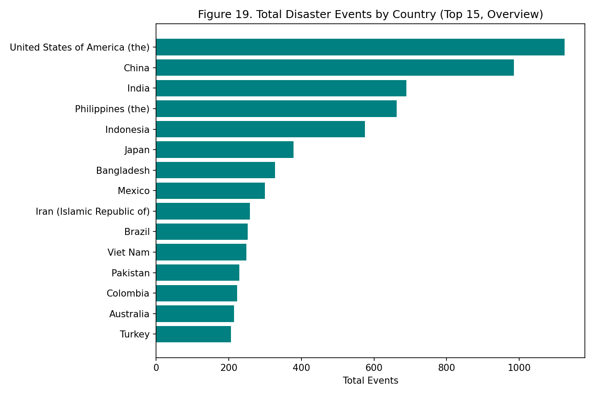

**Figure 19.** Overview bar chart, total events by country (top-15). *Interpretation:* USA (1,125), China (985), and India (689) lead by raw volume — included for orientation, but Figure 17 shows this ranking alone is a misleading basis for prioritizing intervention.

**Figure 20.** Line chart, event trends (5-yr rolling avg) for the top-5 countries. *Interpretation:* The USA and China show the earliest, steepest rises (1960s-70s onward); India, the Philippines, and Indonesia accelerate later (post-1990s) — the "hotspot" set has changed composition over time, not grown uniformly.

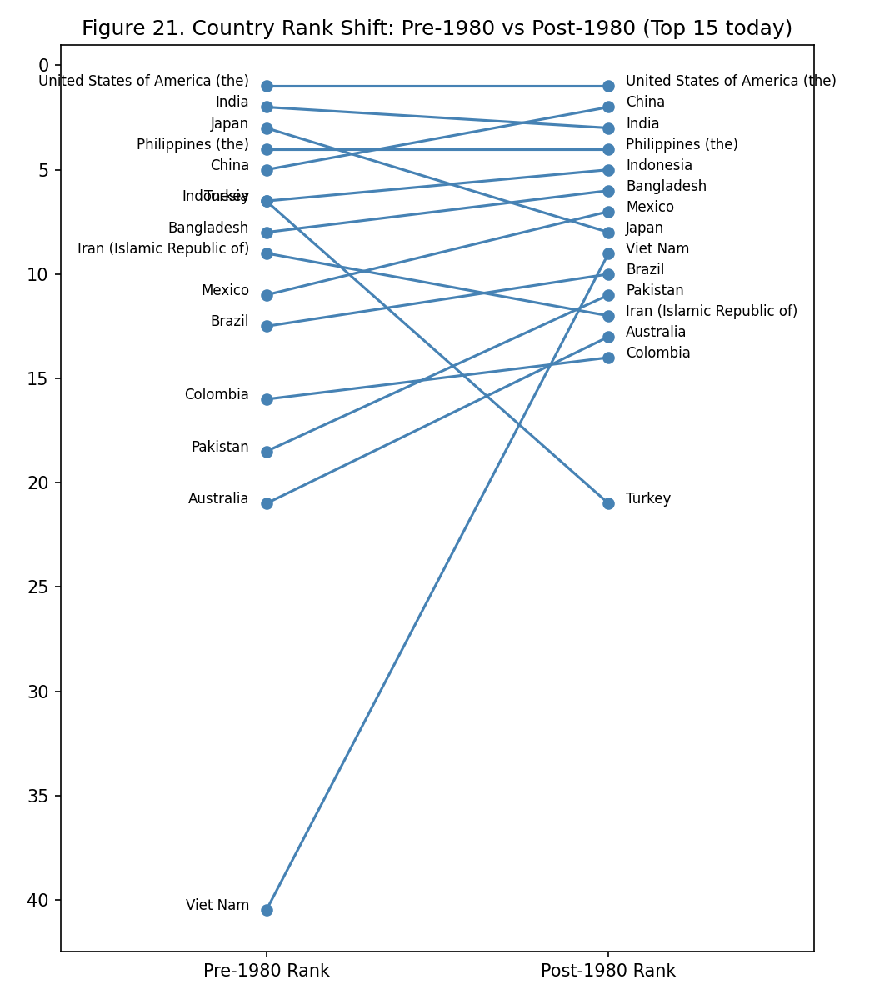

**Figure 21.** Slopegraph, country rank shift from pre-1980 to post-1980 (top-15 countries today). *Interpretation:* Vietnam is the most dramatic mover, from rank 39 pre-1980 to rank 8 post-1980 (12 events pre vs. 236 post — a 19.7× rise), alongside Thailand (26.0×) and Malaysia (17.6×) among all countries with sufficient pre-1980 data — evidence that Southeast Asian flood/storm exposure has grown disproportionately even relative to the global reporting-driven baseline.

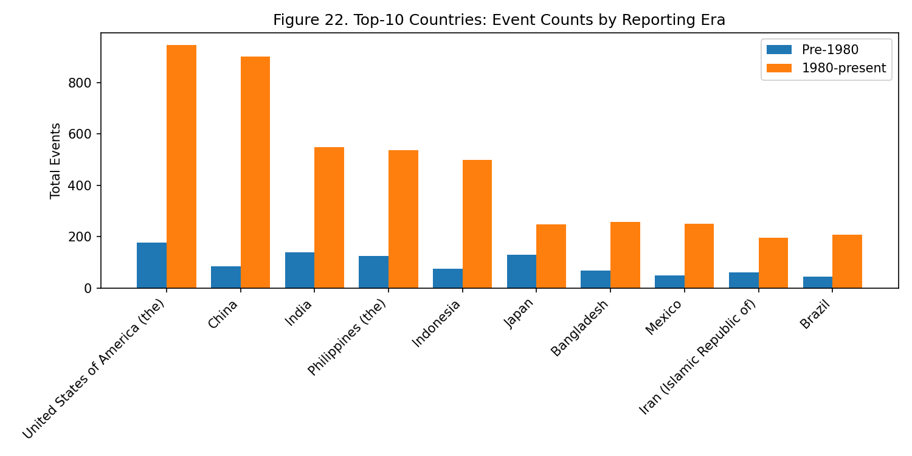

**Figure 22.** Grouped bar, top-10 countries × Reporting Era × Total Events. *Interpretation:* Every top-10 country shows a large absolute jump post-1980, but the jump's *scale* differs sharply — the USA and China's post-1980 counts are roughly 4-6× their pre-1980 counts, while several Southeast/South Asian entrants in the top-10 show much larger multiples, consistent with Figure 21's ranking shift.

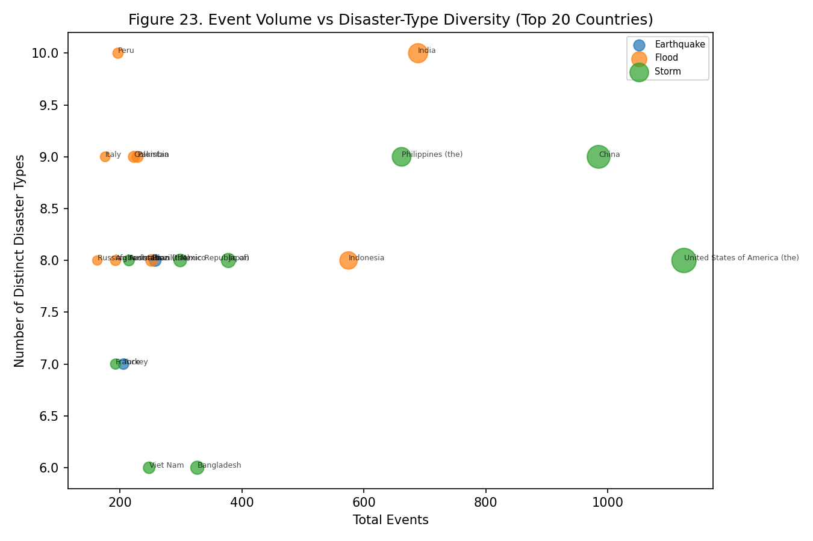

**Figure 23.** Bubble chart, Total Events × Number of Distinct Disaster Types experienced (top-20 countries), color = dominant type. *Interpretation:* India and Peru each experience 10 distinct disaster types — the most diverse exposure profiles in the dataset — while several flood-dominant countries sit lower on the diversity axis despite high event totals, showing that "high volume" and "high diversity of risk" are separate dimensions of exposure.

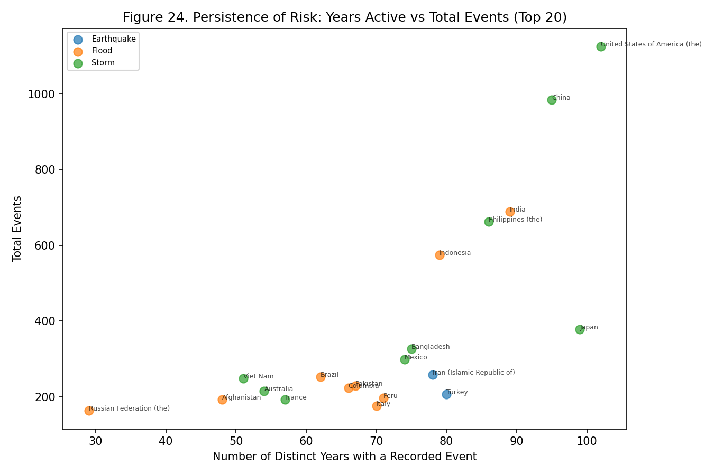

**Figure 24.** Scatter, Years Active (distinct years with a recorded event) × Total Events (top-20 countries), color = dominant type. *Interpretation:* The USA (102 years active), Japan (99), China (95), India (89), and the Philippines (86) have recorded disasters in the overwhelming majority of the dataset's 124-year span — these countries are not just high-volume but persistently, continuously exposed, which is a different and arguably more policy-relevant signal than a raw event count.

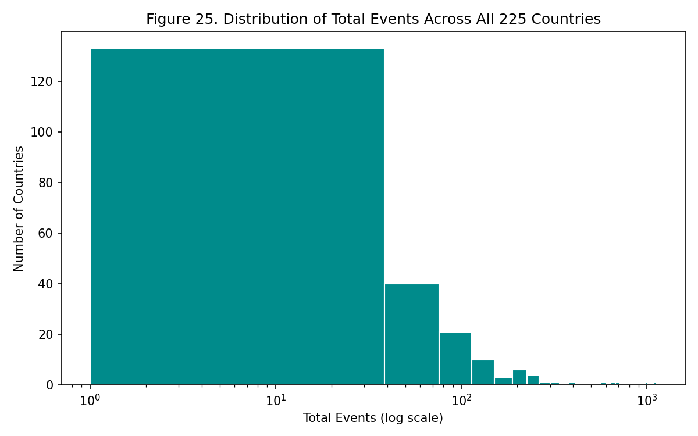

**Figure 25.** Histogram, distribution of Total Events across all 225 countries, log x-axis. *Interpretation:* Event counts are extremely right-skewed across countries — most countries in the dataset record only a handful of events over 124 years, while a small number (the top-15 in Figures 16-24) account for a disproportionate share of the global total, a Pareto-like pattern typical of geographically concentrated natural hazards.

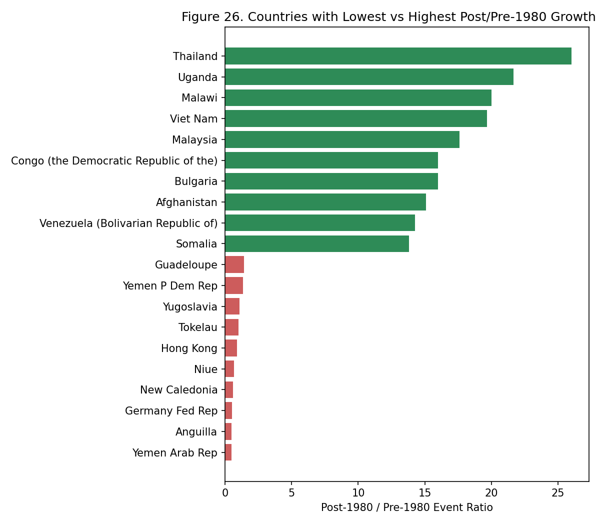

**Figure 26.** Diverging bar, countries with the lowest vs. highest post-1980/pre-1980 event ratio (countries with ≥3 pre-1980 events only). *Interpretation:* Thailand (26.0×), Uganda (21.7×), and Malawi (20.0×) show the largest relative growth, while Yemen Arab Rep., Anguilla, and the former Germany Fed. Rep. show ratios near or below 1× — some of the "decline" cases reflect countries that no longer exist in their pre-1980 form (e.g. German reunification) rather than a genuine drop in disaster exposure, a labeling artifact worth flagging rather than over-interpreting.

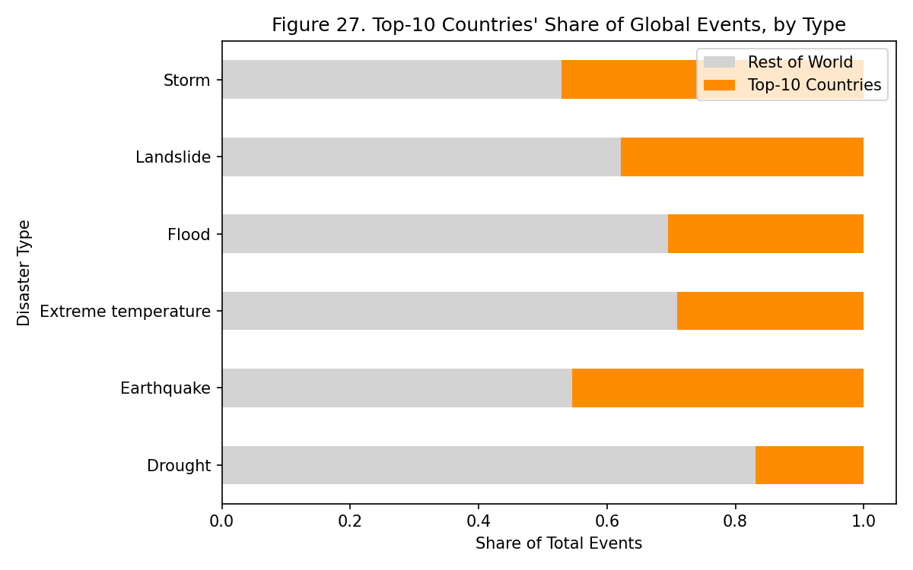

**Figure 27.** Stacked bar, Top-10 countries' vs. Rest-of-World share of global events, by disaster type. *Interpretation:* The top-10 countries capture a majority share of global flood and storm events but a comparatively smaller share of drought events, indicating drought risk is more globally distributed while flood/storm risk is more geographically concentrated in a handful of exposed nations.

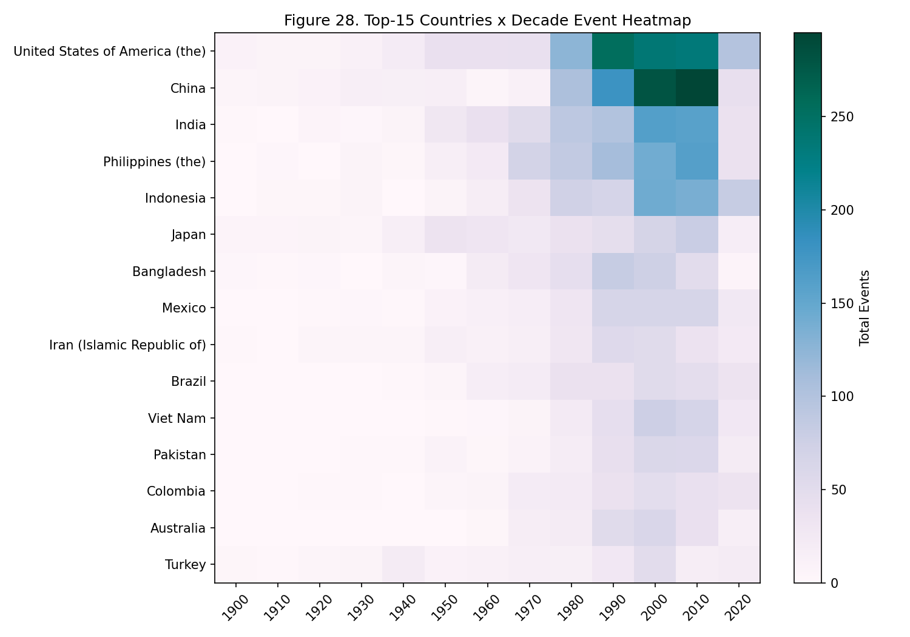

**Figure 28.** Heatmap, top-15 Countries × Decade, color = Total Events. *Interpretation:* This geo-temporal cross-tabulation shows the USA and China's event counts rising across nearly every decade, while several other top-15 countries (e.g. Vietnam, Bangladesh) show a much sharper, later-onset rise concentrated in the 1990s-2010s columns — combining the country ranking of Figure 16 with the temporal pattern of Figure 2 into one view.

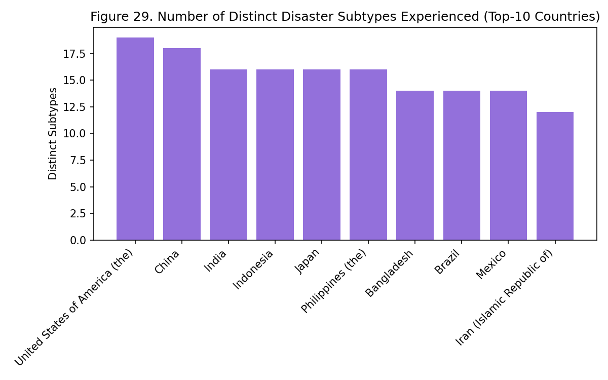

**Figure 29.** Bar chart, number of distinct Disaster Subtypes experienced by top-10 countries. *Interpretation:* This is a finer-grained diversity measure than Figure 23 (which counted top-level Disaster Types) — countries with a high subtype count face a wider variety of specific hazard mechanisms (e.g. both riverine and flash flooding, both tropical and extra-tropical storms) even if their top-level type diversity looks similar, meaning disaster-preparedness plans for these countries need to cover more distinct failure modes.

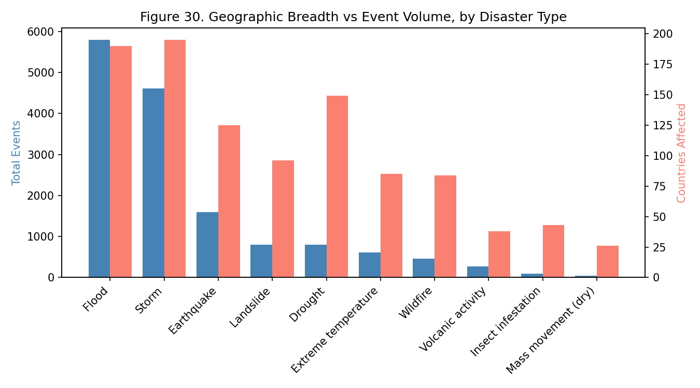

**Figure 30.** Dual-axis bar chart, geographic breadth (number of countries affected) vs. Total Events, by disaster type. *Interpretation:* Storms affect the most countries (195) despite having fewer total events than floods (5,796 events across 190 countries), meaning storms are the most globally *widespread* hazard, while floods are the highest-*volume* hazard — two distinct rankings that would be conflated by looking at either metric alone.

# 7. Task Set C — Impact Severity (Lakshya Jain)

**Variables used:** Total Deaths, Total Affected, Total Damage (USD, original), Total Damage (USD, adjusted), CPI, Disaster Type, Country, Year, Decade

**Tasks:** Top-10 deadliest/costliest; economic damage over time (CPI-adjusted, and CPI shown directly); correlation between event frequency and severity; per-event severity ratios; distributional characteristics of deaths/damage.

**Figure 31.** Scatterplot, Total Events × Total Deaths (log-log, by country-type pair), size = Total Damage, color = Disaster Type. *Interpretation:* Earthquake points sit visibly above the general cloud — comparatively few events per country but disproportionately high deaths — while flood/storm points cluster with high event counts but lower deaths per event. The events-to-deaths relationship is not one proportional line but several parallel bands, one per type, each with a different "lethality slope."

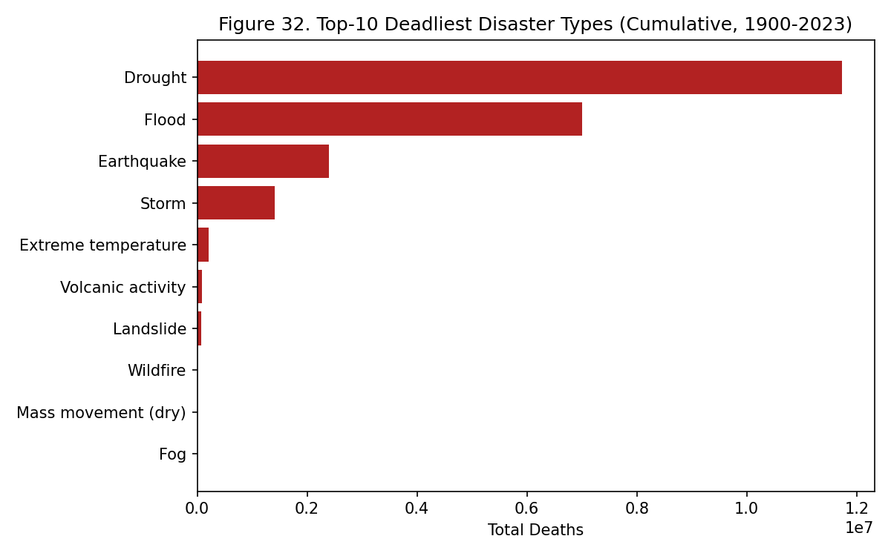

**Figure 32.** Bar chart, top-10 deadliest disaster types by cumulative deaths. *Interpretation:* Drought is the single deadliest category by a wide margin (~11.7 million cumulative deaths from just 802 events), ahead of floods (~7.0 million from 5,796 events) and earthquakes (~2.4 million from 1,596 events) — deaths are driven by a small number of catastrophic events, not sheer event count.

**Figure 33.** Dual-axis time series, Year × Damage (CPI-adjusted) and Year × Deaths. *Interpretation:* CPI-adjusted damage rises from roughly \$291B in the 1970s to a peak of roughly \$2.07 trillion in the 2010s (cumulative, adjusted) — a real increase, not inflation. Deaths spike in individual catastrophic years rather than climbing steadily, suggesting rising economic exposure has outpaced growth in death toll, plausibly due to improved early-warning and evacuation systems.

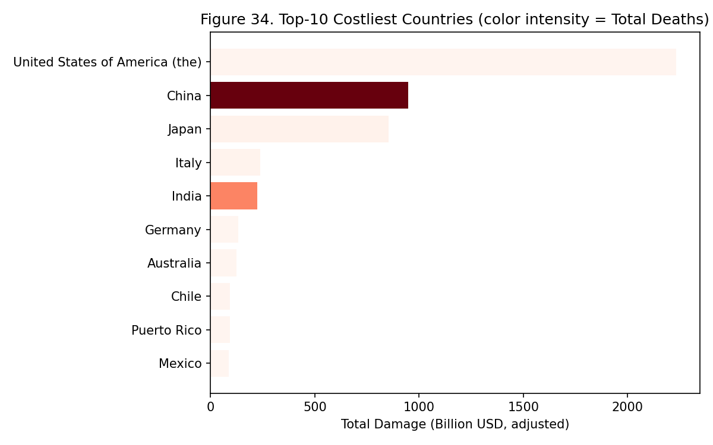

**Figure 34.** Bar chart, top-10 costliest countries by cumulative CPI-adjusted damage, color intensity = Total Deaths. *Interpretation:* Several of the costliest countries by damage show comparatively muted death-toll color intensity relative to their damage rank, consistent with high asset exposure paired with strong disaster-response capacity; a bar that is both long (high damage) and dark (high deaths) flags compounding vulnerability worth prioritizing over either metric alone.

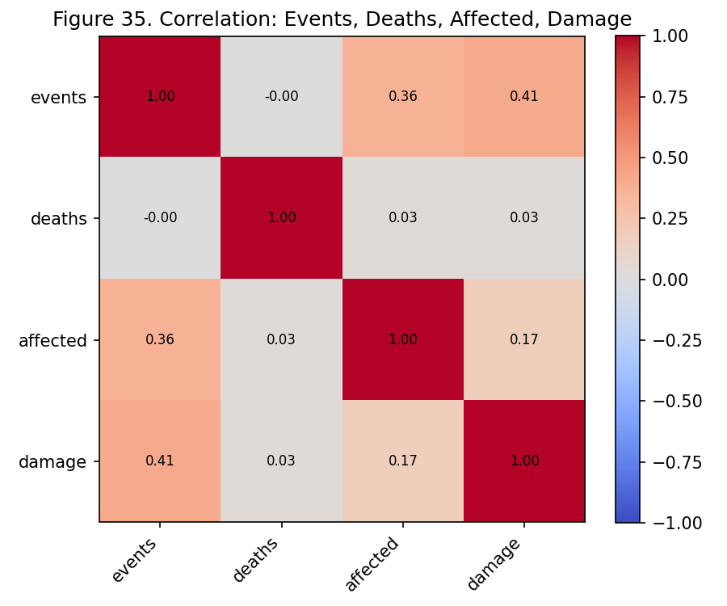

**Figure 35.** Correlation matrix, Events, Deaths, Affected, Damage (aggregated by Country-Year). *Interpretation:* Deaths correlate almost not at all with event count (r ≈ 0.00) and only weakly with affected/damage (r ≈ 0.03), while damage correlates moderately with event count (r ≈ 0.41) — death toll is governed by disaster type and severity, not sheer event count, whereas economic damage scales more directly with how many events occur.

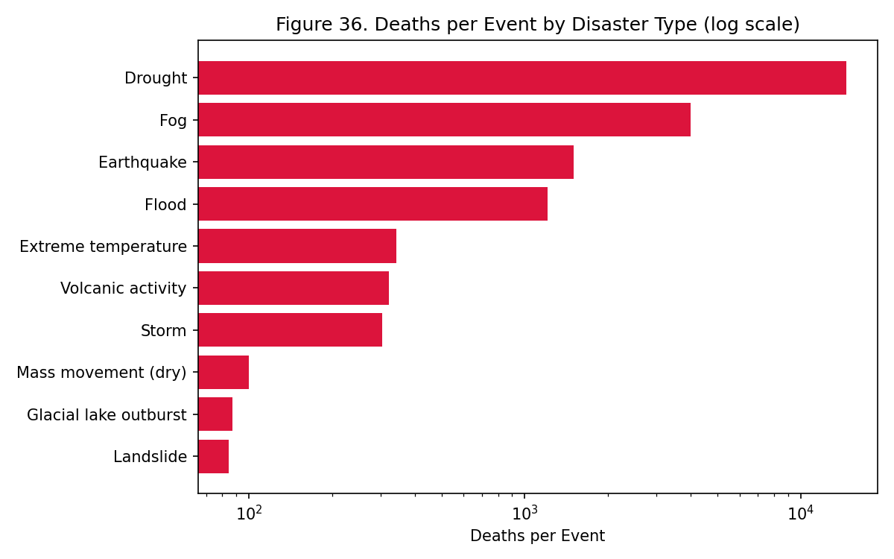

**Figure 36.** Bar chart (log scale), deaths per event by disaster type. *Interpretation:* Drought has the highest deaths-per-event ratio in the dataset (≈14,631 deaths/event) versus earthquake (≈1,503), flood (≈1,208), and storm (≈305) — a roughly 48× spread between the deadliest and least deadly major category, quantitatively confirming Figure 32's finding.

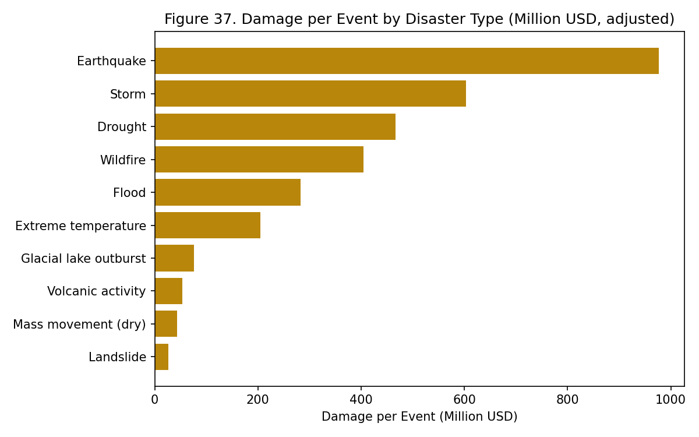

**Figure 37.** Bar chart, damage per event by disaster type (Million USD, adjusted). *Interpretation:* The ranking here differs from Figure 36 — the costliest-per-event types are not the same as the deadliest-per-event types, reinforcing that "severity" is multi-dimensional: a disaster type can be economically catastrophic without being especially lethal, or vice versa (drought, for example, ranks far higher on deaths-per-event than on damage-per-event, since famine-driven mortality is not well captured by infrastructure-damage estimates).

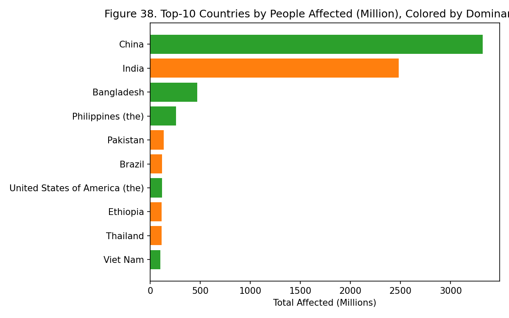

**Figure 38.** Bar chart, top-10 countries by Total Affected (millions), color = dominant disaster type. *Interpretation:* Flood-dominant countries lead this ranking by a wide margin, since floods and droughts tend to affect (displace, injure, or otherwise impact without killing) far more people per event than they kill — Total Affected captures a different and much larger population than Total Deaths (Figure 32).

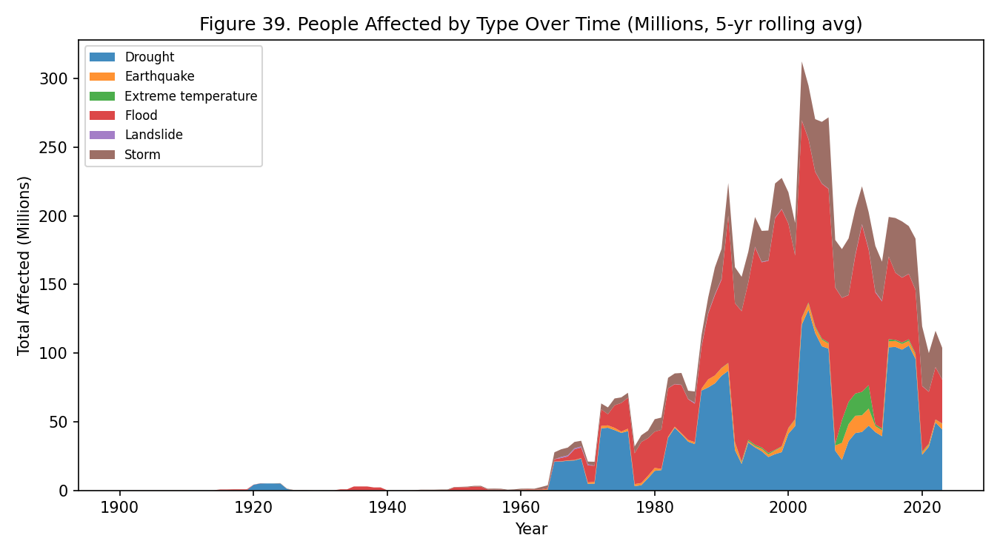

**Figure 39.** Stacked area chart, Year × Disaster Type × Total Affected (millions, 5-yr rolling avg). *Interpretation:* The Total Affected trend mirrors the Total Events trend from Task Set A (Figure 1) in shape, rising sharply post-1980 and dominated by floods — but the absolute scale (tens to hundreds of millions of people per year at the peak) makes clear that even "non-lethal" disaster growth carries a massive humanitarian footprint.

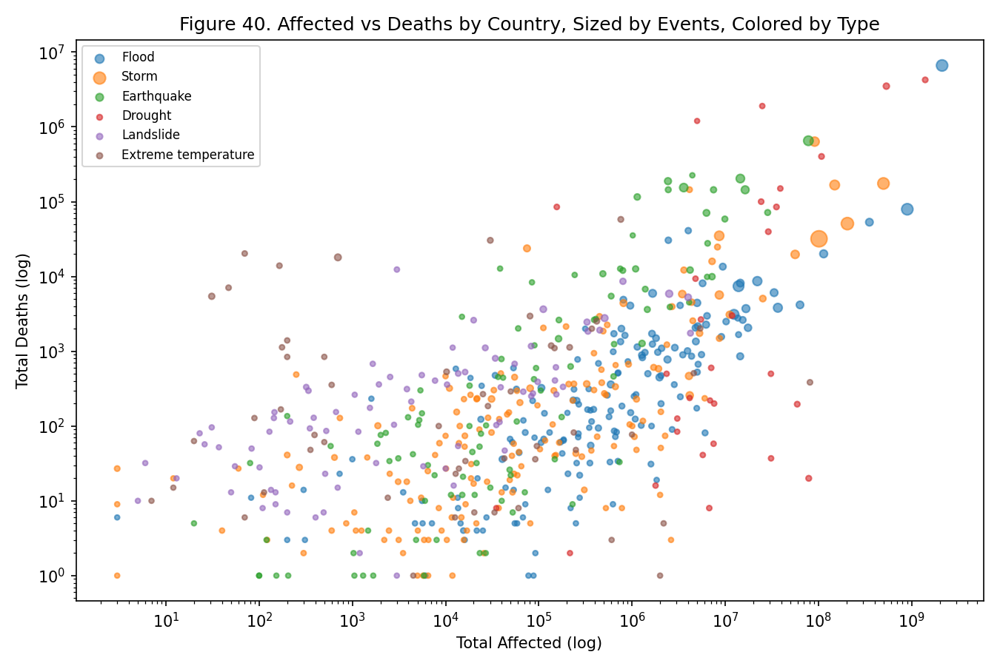

**Figure 40.** Scatterplot, Total Affected × Total Deaths (log-log), size = Total Events, color = Disaster Type. *Interpretation:* This complements Figure 31 by substituting Affected for Events on the x-axis — flood/storm points again cluster at high-affected, lower-death positions, while earthquake points sit higher on the deaths axis for a comparable affected count, reinforcing that earthquakes convert "being affected" into death at a much higher rate than floods/storms do.

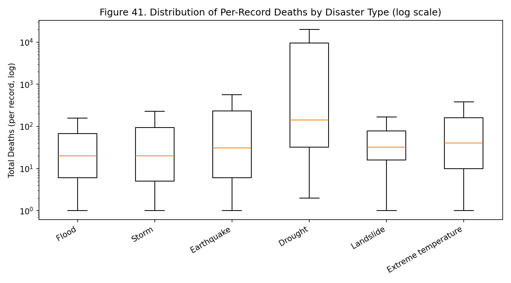

**Figure 41.** Boxplot (log scale), distribution of per-record Total Deaths by disaster type (zero-death records excluded, outliers excluded). *Interpretation:* Earthquake and drought records show both a higher median and a wider spread of per-record deaths than flood/storm records, meaning their high cumulative death tolls (Figure 32) come from individual records being more severe on average, not merely from a few extreme outlier events skewing the total.

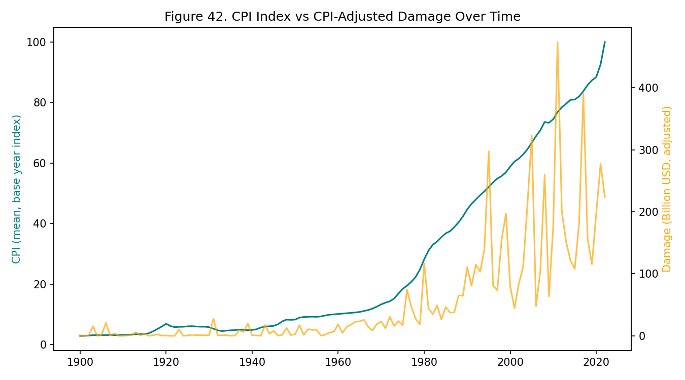

**Figure 42.** Dual-axis time series, Year × CPI (mean) and Year × CPI-Adjusted Damage — the only figure using the CPI field directly rather than only through the pre-computed adjusted-damage column. *Interpretation:* CPI itself rises smoothly and predictably (as expected for a price index), while adjusted damage is far more volatile and spiky, confirming that the damage trend's shape in Figure 33 is a genuine feature of disaster losses and not an artifact of the inflation-adjustment procedure.

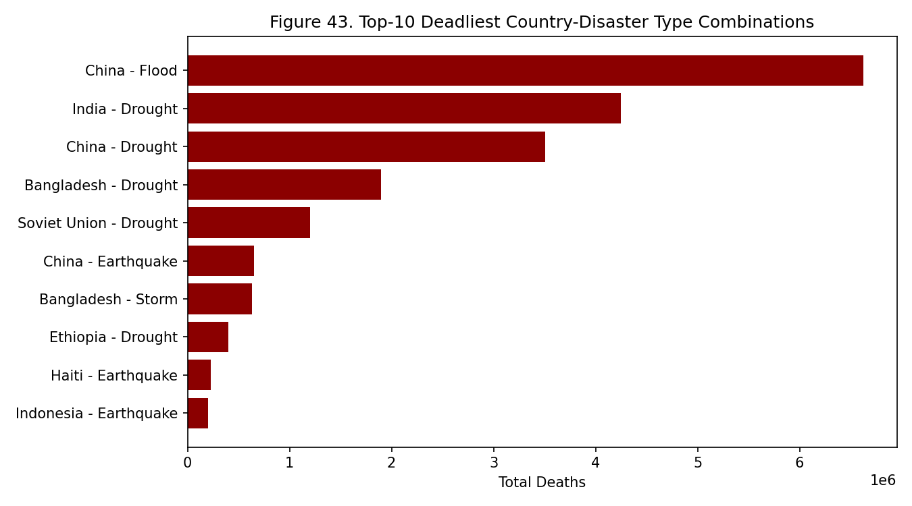

**Figure 43.** Bar chart, top-10 single deadliest Country-Disaster Type combinations by cumulative deaths. *Interpretation:* This figure isolates which specific country-hazard pairings drive the aggregate totals in Figure 32 — several of the top entries are drought-related, consistent with drought's outsized deaths-per-event ratio (Figure 36), showing the aggregate drought death toll is concentrated in a small number of countries rather than spread evenly worldwide.

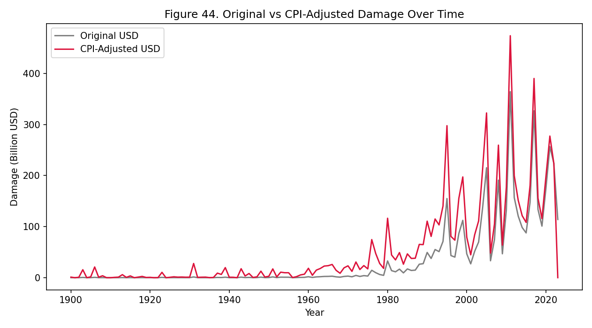

**Figure 44.** Line chart, Year × Total Damage (original USD) vs. Year × Total Damage (CPI-adjusted). *Interpretation:* The two series diverge increasingly for older events — a $1B disaster in 1970 is shown as a much larger adjusted figure — which is precisely the inflation correction at work; the fact that the *adjusted* series (used throughout Figures 33-34, 37) still shows a strong upward trend even after removing the inflation effect confirms the rising-damage finding is real, not a currency-value illusion.

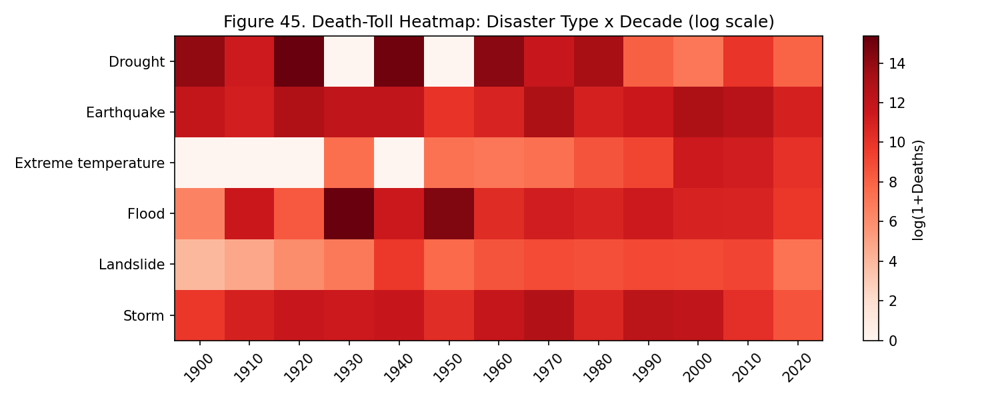

**Figure 45.** Heatmap (log scale), Disaster Type × Decade, color = Total Deaths — the severity-side complement to Figure 2's event-count heatmap. *Interpretation:* Unlike Figure 2, where floods dominate every recent decade, the deadliest cells in this heatmap are scattered across drought and earthquake rows in specific decades (reflecting individual catastrophic famines and earthquakes) rather than concentrated in the same flood-heavy decades — visually confirming that the decades with the *most events* are not the same as the decades with the *most deaths*.

# 8. Limitations

- **Reporting bias, not just a temporal trend:** the entire pre-1980 portion of the dataset should be treated as a lower bound rather than a true count (Figure 3). Cross-country and cross-decade comparisons that span this boundary should be read qualitatively, not as precise ratios.
- **Missing severity data:** roughly 63% of records have no damage figure at all, likely correlated with country income level, meaning damage-based comparisons across countries (Figure 34, 37) may understate the true cost in lower-income, more disaster-exposed nations.
- **Country-boundary artifacts:** some low-ratio entries in Figure 26 (e.g. the former Germany Fed. Rep.) reflect countries that no longer exist in their pre-1980 political form, not a genuine decline in disaster exposure.
- **Country-level aggregation hides sub-national variation:** a country like the USA spans many climate zones; a single "dominant disaster type" (Figures 16-18, 38) can obscure that different disaster types dominate different regions within one country.
- **No population normalization:** Total Events, Total Deaths, and Total Affected are absolute counts, not normalized by population or land area, so larger/more populous countries mechanically rank higher in several figures (e.g. Figure 19) independent of true per-capita risk.
- **CPI adjustment corrects for inflation only:** it does not account for the fact that global infrastructure value has grown over the same period, so some of the rising CPI-adjusted damage trend (Figure 33, 42) reflects more assets being exposed to disasters, not disasters becoming individually more destructive.

# 9. Overall Conclusions

Across all three task sets, a consistent and quantified picture emerges. Recorded disaster activity rises sharply after 1970-80 (Task Set A), but the rise is uneven across types — floods rise 17.8× and storms 9.2× versus a 3.8× rise for earthquakes, a physically-salient control category — indicating a real increase in hydro-meteorological disasters layered on top of a reporting-infrastructure baseline shift. This rise concentrates in a shifting set of countries (Task Set B): the USA and China lead historically, while Vietnam, Thailand, and Malaysia show the largest relative growth (19.7×, 26.0×, and 17.6× respectively) between reporting eras, and each country's disaster-type composition and diversity is distinct rather than uniform. Finally, human cost is governed less by event frequency and more by disaster type (Task Set C): drought causes the highest deaths-per-event by a factor of roughly 48× over the least lethal major category, even though it has far fewer recorded events than floods or storms, while economic damage scales much more directly with event count (r ≈ 0.41). Together, this argues for **disaggregated disaster policy**: flood/storm-prone nations — especially the newly-emergent hotspots in Southeast Asia — need frequency-driven infrastructure mitigation, while regions exposed to low-frequency, high-lethality events (drought, earthquake) need severity-driven early-warning and famine/relief-response investment regardless of how often those events occur.

# 10. Author Contributions

| Member | Roll Number | Task Set | Contribution |
|---|---|---|---|
| Arnav Jain | BT2024233 | A — Temporal Trends | Preprocessing, Task Set A analysis and Figures 1-15, repository setup |
| Kalpit Phogat | BT2024093 | B — Geographic Distribution | Task Set B analysis and Figures 16-30 |
| Lakshya Jain | BT2024044 | C — Impact Severity | Task Set C analysis and Figures 31-45 |

**Data preprocessing:** Arnav Jain (also covers the first minute of the video demo).

**Report writing/compilation:** Arnav Jain, with contributions from all members for their respective task sets.

# 11. AI Declaration

Separate AI declaration forms for each team member are included as an appendix (see `ai_declaration_form.md` / attached forms).
