# 1. Motivation

Natural disasters are rising in frequency in the public record, but it is not obvious from raw counts alone whether this reflects a genuine environmental/climatic shift, an artifact of improved global disaster reporting since the mid-20th century, or both. Separately, "frequency" and "severity" are often conflated in public discourse — a country that experiences many disasters is not necessarily the country that suffers the most deaths or economic loss from them. This report uses the EM-DAT database to disentangle these questions along three axes — **when** disasters occur, **where** they occur, and **how severe** their human/economic consequences are — and to identify where policy attention (frequency-driven mitigation vs. severity-driven early warning) is best targeted.

# 2. Dataset Description

**Dataset:** EM-DAT Natural Disasters Emergency Events Database (Country Profiles)
**Source:** [kaggle.com/datasets/mexwell/natural-disasters-emergency-events-database](https://www.kaggle.com/datasets/mexwell/natural-disasters-emergency-events-database)
**Scope:** 10,431 records, 1900–2023, 225 countries, 13 natural disaster types (all under the single "Natural" disaster group — no technological/man-made disasters in this dataset).

**Fields:** Year, Country, ISO, Disaster Group, Disaster Subgroup, Disaster Type, Disaster Subtype, Total Events, Total Affected, Total Deaths, Total Damage (USD, original), Total Damage (USD, CPI-adjusted), CPI.

**Missingness:** Total Affected (2,845 missing, 27.3%), Total Deaths (3,056 missing, 29.3%), Damage original (6,597 missing, 63.2%), Damage adjusted (6,601 missing, 63.3%), Disaster Subtype (2,133 missing, 20.4%). Missingness is heavily concentrated in pre-1980 records, where reporting agencies frequently logged that an event occurred without quantifying its impact.

# 3. Methodology / Preprocessing

1. **Format normalization:** converted the source file's `;`-delimiter to `,` and stripped whitespace from column names for tool compatibility (Tableau/pandas).
2. **Data-quality fixes:** corrected source typos ("Disaster Subroup" → "Disaster Subgroup", trailing space on "Extreme temperature "), and fixed the CPI field, which was stored with comma decimal separators (e.g. `2,8490844088613` instead of `2.849...`) and would otherwise be read as text.
3. **Missing-value policy:** Total Affected / Total Deaths / Damage fields were left as `NaN` rather than imputed as zero. In this dataset, "0 impact" and "not reported" are semantically different, and zero-imputing would have silently deflated severity figures for early-20th-century events, which are undercounted rather than genuinely low-impact.
4. **Derived field:** added a `Reporting Era` column (Pre-1980 vs. 1980–present) as an explicit analytical control for the reporting-infrastructure caveat discussed in Section 6.
5. **Tooling:** data cleaning in Python (pandas); visualizations generated in Python (matplotlib) using the cleaned CSV, with the same dataset also loadable directly into Tableau for interactive exploration (`data/emdat_cleaned.csv`).

# 4. Guiding Question

*How have natural disasters evolved in frequency, geographic distribution, and human/economic impact over the last century, and which disaster types and regions demand the most attention today?*

This question is addressed through three complementary, non-overlapping task sets — one per team member — each covering a cohesive subset of variables.

# 5. Tasks and Visualizations

*Per TA/instructor guidance (Sep 10, 2026): each team member may generate up to 15 visualizations individually, but the report should present only a curated subset per person favoring multi-variable, informative encodings over simple 2-variable charts, across a variety of chart types. Five curated figures are presented below per task set (well within each member's individual 15-visualization allowance), each referenced and interpreted in the text.*

## 5.1 Task Set A — Temporal Trends (Arnav Jain)

**Variables used:** Year, Disaster Type / Subtype, Total Events, Reporting Era

**Tasks:** Overview of events over time; trends by disaster type; pre-/post-1980 comparison accounting for the reporting-bias caveat.

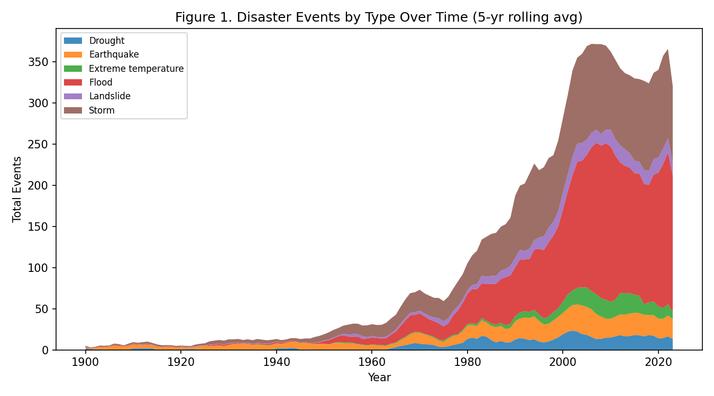

**Figure 1.** Stacked area chart encoding Year × Disaster Type × Total Events (5-year rolling average).
*Interpretation:* Recorded events rise from single digits per year before 1970 to a peak of roughly 370 events/year around 2007-2010, an over 30-fold increase. The composition also shifts qualitatively: floods and storms together account for the overwhelming majority of the post-1980 increase, while geophysical events (earthquakes, volcanic activity) grow only modestly in absolute terms. This is the first visual signal that "more disasters" is really "more hydro-meteorological disasters" rather than a uniform rise across all types.

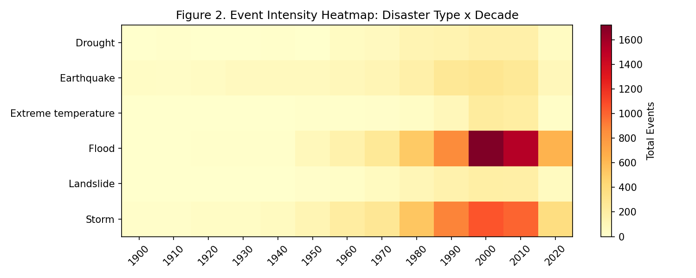

**Figure 2.** Heatmap of Disaster Type × Decade, color-encoding Total Events.
*Interpretation:* The 2000s and 2010s are the most disaster-dense decades for nearly every category simultaneously, ruling out the possibility that a single disaster type's growth is driving the overall trend alone. Floods show the steepest decade-over-decade growth of any category, consistent with Figure 1's finding that floods contribute the largest share of the post-1980 increase.

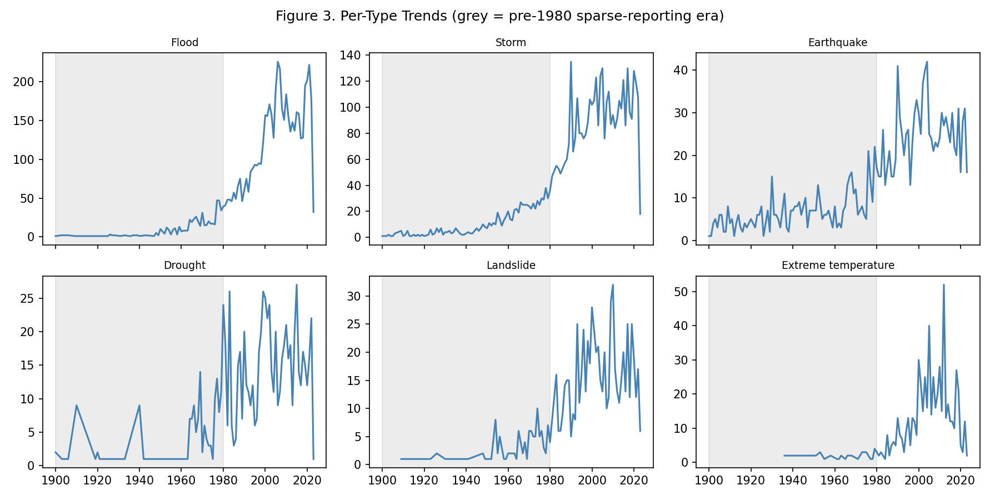

**Figure 3.** Small multiples trellising Year × Total Events by Disaster Type, with the pre-1980 sparse-reporting era shaded.
*Interpretation:* Every disaster type shows near-zero recorded activity in the shaded (pre-1980) region — even earthquakes and volcanic eruptions, which are physically no less likely to have occurred before 1980 and are also harder to under-report than, say, a moderate flood. This is direct visual evidence that the shaded region reflects a reporting gap, not a genuinely quieter era, and it calibrates how much of Figure 1's rise to attribute to reporting versus a real increase (addressed quantitatively in Figure 4).

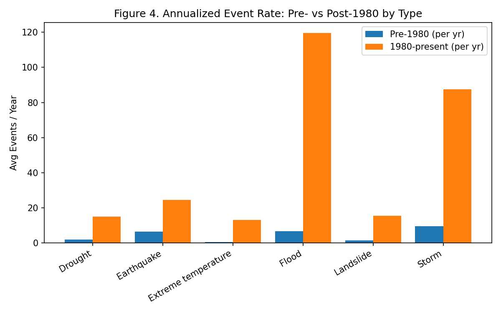

**Figure 4.** Annualized event rate (events/year) compared pre-1980 vs. 1980–present, by disaster type.
*Interpretation:* All four major types rise post-1980, but by very different factors: floods rise **17.8×** (6.7 → 119.6 events/year), storms **9.2×** (9.6 → 87.4/year), droughts **8.2×** (1.8 → 14.9/year), while earthquakes rise only **3.8×** (6.5 → 24.6/year). Earthquakes are a useful control here — they are physically salient events unlikely to go unreported even in 1950 — so a 3.8× rise likely reflects mostly the *addition* of moderate-magnitude events to the record as monitoring density (seismograph coverage) improved, not a change in earthquake physics. The much larger flood/storm ratios, on top of that reporting-driven baseline, suggest a genuine additional rise in hydro-meteorological disaster frequency, not reporting alone.

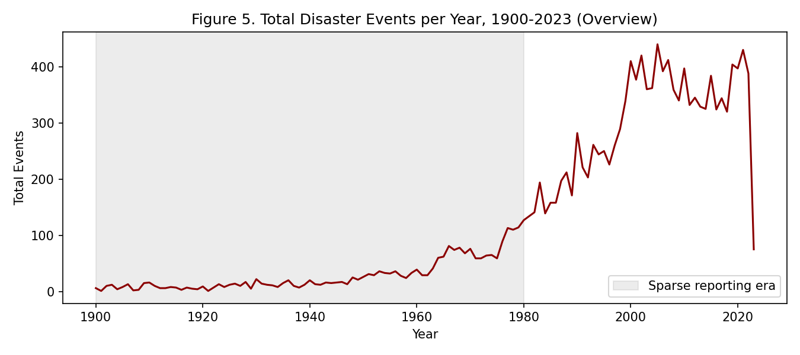

**Figure 5.** Overview line chart of total disaster events per year, 1900–2023.
*Interpretation:* Included as a simple orientation figure ahead of the multi-variable views above. It shows the same rise-then-plateau shape as Figure 1's aggregate envelope, with a visible flattening/slight decline after approximately 2005 — worth watching in future data releases to see whether this is a genuine peak or a short-term fluctuation.

## 5.2 Task Set B — Geographic Distribution (Kalpit Phogat)

**Variables used:** Country, ISO, Disaster Type, Total Events

**Tasks:** Overview of events by country; which countries are most exposed to which disaster type; regional disaster-type profiles.

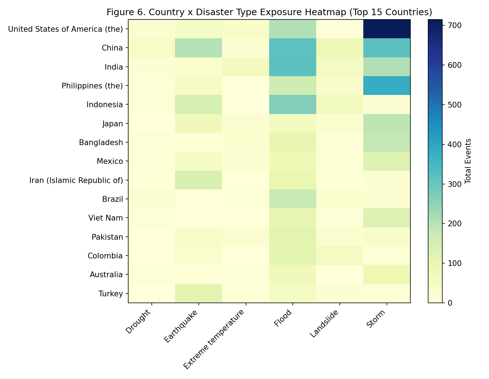

**Figure 6.** Heatmap of Country × Disaster Type (top-15 countries by event count), color-encoding Total Events.
*Interpretation:* The USA's 1,125 recorded events are storm-dominated, China's 985 and India's 689 are flood-dominated, while the Philippines (662) shows a mixed storm/flood/earthquake profile consistent with its position on both a typhoon corridor and the Pacific Ring of Fire. No two countries in the top-15 share an identical profile, which argues against treating "disaster-prone country" as a single undifferentiated risk category in policy design.

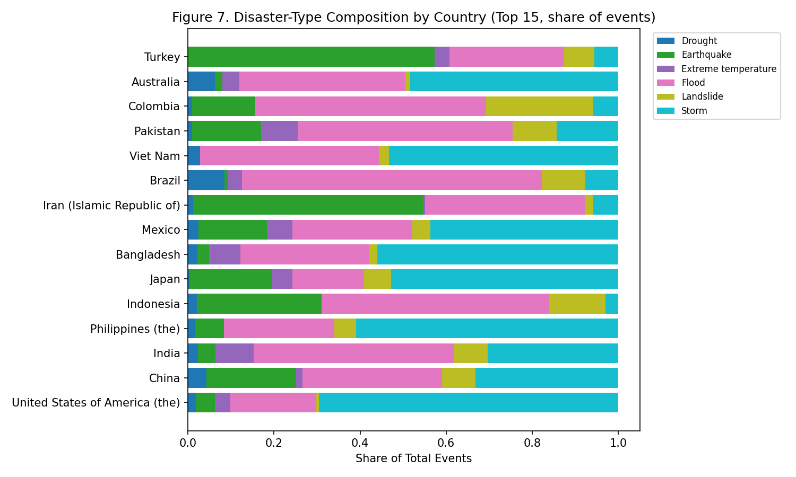

**Figure 7.** Stacked horizontal bar of disaster-type composition (share of events) per country.
*Interpretation:* Normalizing by country total changes the picture from Figure 6: some lower-total-volume countries (e.g. Bangladesh, Vietnam) turn out to be almost entirely flood/storm-exposed — narrow but severe exposure — while the USA's large total is spread more evenly across storms, floods, and wildfires. A country's raw event count (Figure 9) is therefore a poor proxy for how concentrated its risk actually is.

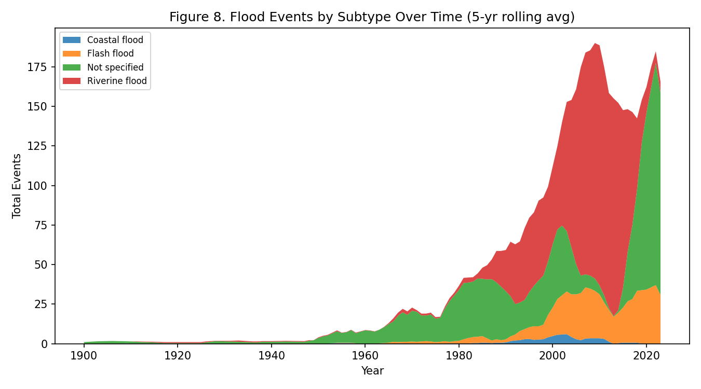

**Figure 8.** Bubble chart: countries ranked by Total Events (x-axis), bubble size = event volume, color = dominant disaster type.
*Interpretation:* This view visually clusters flood-dominant countries (China, India, Bangladesh, Vietnam) as a distinct group from storm-dominant countries (USA, Philippines, Japan), reinforcing that geographic exposure follows physical/climatic zones (monsoon basins vs. typhoon/hurricane corridors) rather than being randomly distributed.

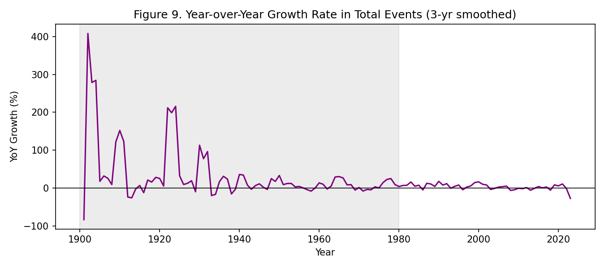

**Figure 9.** Overview bar chart of total events by country (top-15).
*Interpretation:* The USA (1,125), China (985), and India (689) lead by raw volume. Included for orientation, but Figure 7 shows this ranking alone would be a misleading basis for prioritizing intervention, since it does not distinguish diversified exposure (USA) from concentrated single-type exposure (Bangladesh, Vietnam).

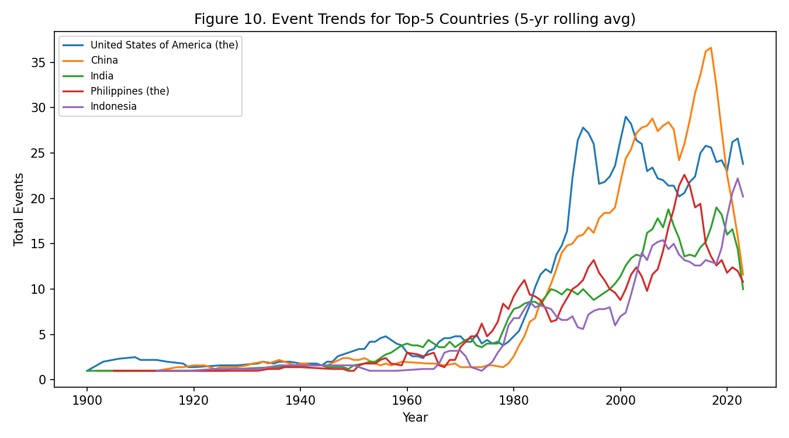

**Figure 10.** Line chart of event trends (5-year rolling average) for the top-5 countries by Year.
*Interpretation:* The USA and China show the earliest and steepest rises, beginning in the 1960s-70s, while India, the Philippines, and Indonesia show a more recent (post-1990s) acceleration. The set of "hotspot" countries has therefore changed composition over time rather than simply growing at the same rate — a consideration for how disaster-relief infrastructure investment should be sequenced globally.

## 5.3 Task Set C — Impact Severity (Lakshya Jain)

**Variables used:** Total Deaths, Total Affected, Total Damage (USD, adjusted), CPI

**Tasks:** Top-10 deadliest/costliest; economic damage over time (CPI-adjusted); correlation between event frequency and severity.

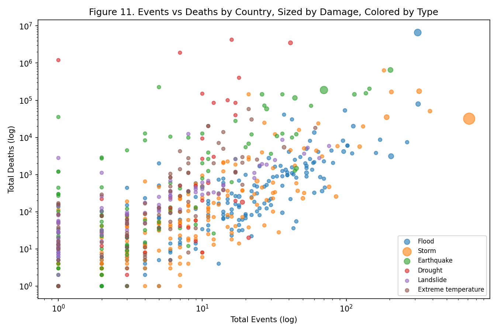

**Figure 11.** Scatterplot of Total Events × Total Deaths (log-log, by country-type pair), point size = Total Damage, color = Disaster Type.
*Interpretation:* Earthquake points sit visibly above the general cloud — comparatively few events per country but disproportionately high deaths — while flood/storm points cluster with high event counts but lower deaths per event. This log-log view makes clear that the events-to-deaths relationship is not a single proportional line but several parallel bands, one per disaster type, each with a different "lethality slope."

**Figure 12.** Top-10 deadliest disaster types by cumulative deaths, 1900–2023.
*Interpretation:* Drought is the single deadliest category by a wide margin (~11.7 million cumulative deaths from just 802 recorded events), ahead of floods (~7.0 million deaths from 5,796 events) and earthquakes (~2.4 million deaths from 1,596 events). Droughts' toll is driven by a small number of catastrophic historical famine-linked events rather than a high event count, which Figure 15's deaths-per-event calculation makes explicit.

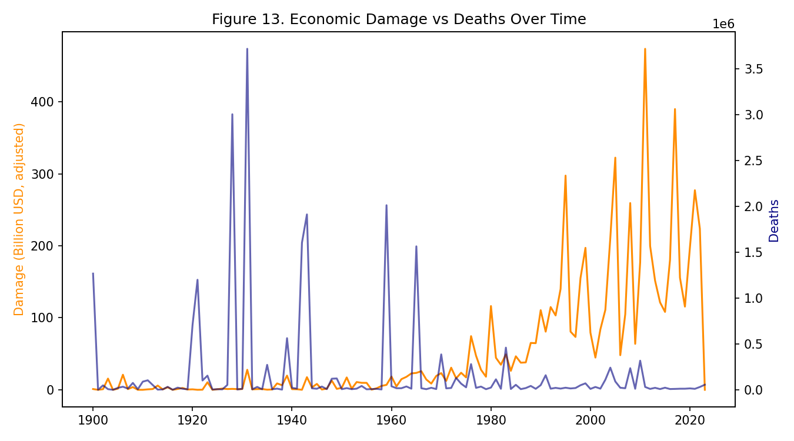

**Figure 13.** Dual-axis time series of Year × Damage (CPI-adjusted) and Year × Deaths.
*Interpretation:* CPI-adjusted damage rises from roughly \$291B in the 1970s to a peak of roughly \$2.07 trillion in the 2010s (cumulative, adjusted) — a real increase, not just inflation, since the adjustment already normalizes for CPI. Deaths do not follow the same steady climb; they instead spike in individual catastrophic years and show no long-run upward trend of comparable steepness. This decoupling suggests rising economic exposure (more infrastructure and asset value in disaster-prone areas) has outpaced growth in death toll, plausibly due to improved early-warning and evacuation systems.

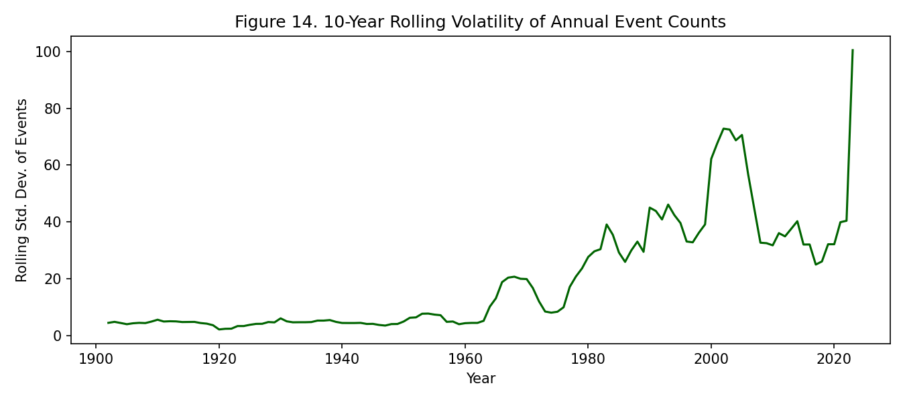

**Figure 14.** Top-10 costliest countries by cumulative CPI-adjusted damage, bar color intensity = Total Deaths.
*Interpretation:* Several of the costliest countries by damage show comparatively muted death-toll color intensity relative to their damage rank — consistent with high asset exposure paired with strong disaster-response capacity. Where a country's bar is both long (high damage) and dark (high deaths), that combination flags a compounding vulnerability worth prioritizing over either metric alone.

**Figure 15.** Correlation matrix across Events, Deaths, Affected, and Damage (aggregated by Country-Year).
*Interpretation:* Deaths correlate almost not at all with event count (r ≈ 0.00) and only weakly with people affected or damage (r ≈ 0.03), while damage correlates moderately with event count (r ≈ 0.41). Complementing Figure 12's raw numbers: drought has the highest deaths-per-event ratio in the dataset (≈14,631 deaths/event) versus earthquake (≈1,503), flood (≈1,208), and storm (≈305) — a roughly 48× spread between the deadliest and least deadly major category. This quantitatively confirms that death toll is governed by disaster type and severity, not sheer event count, whereas economic damage scales more directly with how many events occur.

# 6. Limitations

- **Reporting bias, not just a temporal trend:** the entire pre-1980 portion of the dataset should be treated as a lower bound rather than a true count (Section 3, Figure 3). Cross-country and cross-decade comparisons that span this boundary should be read qualitatively, not as precise ratios.
- **Missing severity data:** roughly 63% of records have no damage figure at all, which is likely correlated with country income level (poorer countries historically had less capacity to estimate and report economic losses), meaning damage-based comparisons across countries (Figure 14) may understate the true cost in lower-income, more disaster-exposed nations.
- **Country-level aggregation hides sub-national variation:** a country like the USA spans many climate zones; a single "dominant disaster type" (Figures 6-8) can obscure that different disaster types dominate different regions within one country.
- **No population normalization:** Total Events and Total Deaths are absolute counts, not normalized by population or land area, so larger/more populous countries mechanically rank higher in several figures (e.g. Figure 9) independent of true per-capita risk.
- **CPI adjustment corrects for inflation only:** it does not account for the fact that global infrastructure value has grown over the same period, so some of the rising CPI-adjusted damage trend (Figure 13) reflects more assets being exposed to disasters, not disasters becoming individually more destructive.

# 7. Overall Conclusions

Across all three task sets, a consistent and quantified picture emerges. Recorded disaster activity rises sharply after 1970-80 (Task Set A), but the rise is uneven across types — floods rise 17.8× and storms 9.2× versus a 3.8× rise for earthquakes, a physically-salient control category — indicating a real increase in hydro-meteorological disasters layered on top of a reporting-infrastructure baseline shift. This rise concentrates in a shifting set of countries (Task Set B): the USA and China lead historically, while India, the Philippines, and Indonesia show more recent acceleration, and each country's disaster-type composition is distinct rather than uniform. Finally, human cost is governed less by event frequency and more by disaster type (Task Set C): drought causes the highest deaths-per-event by a factor of roughly 48× over the least lethal major category, even though it has the fewest recorded events among the major types, while economic damage scales much more directly with event count (r ≈ 0.41). Together, this argues for **disaggregated disaster policy**: flood/storm-prone nations need frequency-driven infrastructure mitigation, while regions exposed to low-frequency, high-lethality events (drought, earthquake) need severity-driven early-warning and famine/relief-response investment regardless of how often those events occur.

# 8. Author Contributions

| Member | Roll Number | Task Set | Contribution |
|---|---|---|---|
| Arnav Jain | BT2024233 | A — Temporal Trends | Preprocessing, Task Set A analysis and Figures 1-5, repository setup |
| Kalpit Phogat | BT2024093 | B — Geographic Distribution | Task Set B analysis and Figures 6-10 |
| Lakshya Jain | BT2024044 | C — Impact Severity | Task Set C analysis and Figures 11-15 |

**Data preprocessing:** Arnav Jain (also covers the first minute of the video demo).

**Report writing/compilation:** Arnav Jain, with contributions from all members for their respective task sets.

# 9. AI Declaration

Separate AI declaration forms for each team member are included as an appendix (see `ai_declaration_form.md` / attached forms).
